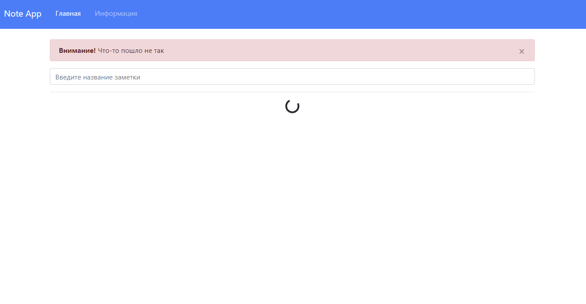

# Todolist-hooks-app

Simple TodoList app

Deployed here - https://todolist-hooks-31dc9.web.app/

# Description
- source: https://www.youtube.com/watch?v=V1rhxheJg4A
- stack:
    - firebase, firebase-tools,
    - yarn, axios, react, react-dom, react-router-dom, node-sass, bootstrap, react-transition-group
    - hooks (useState, useContext, useReducer, useEffect)

# Environment
- node v20.11.1
- yarn v1.22.19

# How to run locally
1. clone this repository
  - git clone https://github.com/lysenko86/learning_todolist-hooks.git
2. go to project folder and install packages
  - yarn install
  - yarn install -g nodemon
3. run project locally
  - nodemon index.js
4. it should be started here
  - http://localhost:3000/